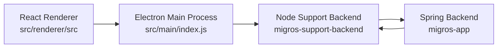

# Migros Support App

Desktop support client for operators to manage customer conversations (inbox + live chat) through a Node support backend and a Spring Boot backend.

# Note
* This project is mostly vibe-coded, built with the Codex desktop app.
* This project has nothing to do with Migros company; it's just my hobby project.

## Overview

This project is the operator UI layer of a 2-repo support system:

- [migros-app-bridge](https://github.com/motionnblur/migros-app-bridge): Node.js/Express bridge + projection tables
- [migros-app](https://github.com/motionnblur/migros-app): Spring Boot backend (source of truth)

The desktop app authenticates support users, lists conversations, reads/writes messages, and performs moderation actions (ban/unban/clear chat).

## Features

- Operator login with JWT session handling
- Conversation inbox with unread badges and priority labels
- Conversation presence status (online/offline)
- Message polling and auto-refresh
- Send, edit, and delete agent messages
- Ban/unban customer conversation
- Clear conversation history
- Customer search and first-message flow for customers without an existing conversation
- Responsive layout for desktop and mobile-sized windows

## Architecture



### Runtime flow

1. User logs in from renderer through `window.electronAPI.login(...)`.
2. Electron main process calls Node backend `POST /auth/login`.
3. JWT is stored in `localStorage` and validated on startup + interval checks.
4. Renderer polls:
   - conversations every 5 seconds
   - selected conversation messages every 4 seconds
   - conversation status/presence every 10 seconds
5. Write actions (send/edit/delete/ban/unban/clear) go through Electron main process to Node backend, then forward to Spring internal endpoints.

## Tech stack

- Electron `^30`
- React `^18`
- Material UI `^5`
- electron-vite `^2`
- ESLint

## Project structure

- `src/main/index.js`: Electron app entry, IPC handlers, HTTP calls to support backend
- `src/preload/index.js`: secure API bridge exposed as `window.electronAPI`
- `src/renderer/src/App.jsx`: auth/session bootstrap and app shell switching
- `src/renderer/src/components/auth/LoginView.jsx`: login form
- `src/renderer/src/components/workspace/*`: inbox and chat workspace UI
- `src/renderer/src/utils/auth.js`: JWT decoding/expiry helpers

## API and IPC contract

Renderer calls preload methods, which invoke Electron IPC channels, which call Node backend endpoints.

### Auth

- IPC: `auth:login`
- Node API: `POST /auth/login`

### Conversations and messages

- `support:get-conversations` -> `GET /support/conversations`
- `support:get-conversation-statuses` -> `GET /support/conversations/status?conversationIds=...`
- `support:search-customers` -> `GET /support/customers`
- `support:get-messages` -> `GET /support/conversations/:conversationId/messages`
- `support:send-message` -> `POST /support/conversations/:conversationId/messages`
- `support:edit-message` -> `PATCH /support/conversations/:conversationId/messages/:messageId`
- `support:delete-message` -> `DELETE /support/conversations/:conversationId/messages/:messageId`

### Moderation

- `support:ban-conversation` -> `POST /support/conversations/:conversationId/ban`
- `support:unban-conversation` -> `POST /support/conversations/:conversationId/unban`
- `support:clear-conversation` -> `POST /support/conversations/:conversationId/clear`

## Prerequisites

- Node.js 18+ and npm
- Running `migros-support-backend` service
- Running `migros-app` stack (Spring + dependencies, usually via Docker Compose)

## Environment variables

Create `.env` in this repo:

```env
SUPPORT_API_BASE_URL=http://127.0.0.1:3000
```

If omitted, default is `http://127.0.0.1:3000`.

## Coupled service configuration (important)

For end-to-end support features, internal keys must match across services:

- Node backend `SPRING_SUPPORT_INTERNAL_KEY` must match Spring `support.internal.key` (`SUPPORT_INTERNAL_KEY`)
- Spring publisher key `support.service.internal-key` (`SUPPORT_SERVICE_INTERNAL_KEY`) must match Node `INTERNAL_EVENT_KEY`

If these are misaligned, internal actions/event sync can fail with `401` or `502`.

## Local development setup

Recommended startup order:

1. Start Spring Boot backend`migros-app\`:
   - `docker compose --env-file configs/postgres.env --env-file configs/spring.env up`
   - `docker compose up` (alternatively if you want single .env)
2. Start Node support backend in `migros-support-backend\`:
   - `npm run dev`
3. Start this desktop app:
   - `npm install`
   - `npm run dev`
  
.env file example
```
DB_HOST=localhost
DB_PORT=5432
DB_NAME=migros_support_db
DB_USER=postgres
DB_PASSWORD=1

JWT_SECRET=SECRET_TEST
JWT_EXPIRES_IN=1h
```

## Available scripts

- `npm run dev`: start Electron app in development mode
- `npm run build`: build main/preload/renderer bundles
- `npm run preview`: preview build output
- `npm run lint`: run ESLint on `.js` and `.jsx`

## Build

```bash
npm run build
```

Build output is generated under `out/`.

## Operational notes

- `conversationId` is effectively `userMail` in current behavior.
- UI is polling-based (not websocket), so expect 4-5 seconds of sync delay.
- Reading messages resets unread counters on backend projection.
- Edit/delete actions are restricted by backend rules (`sender = AGENT`, `can_edit = true`).
- `mockSupportData.js` is not runtime source of truth.

## Troubleshooting

- Login fails:
  - confirm Node support backend is reachable at `SUPPORT_API_BASE_URL`
  - verify credentials exist in backend `users` table
- Conversations/messages do not update:
  - confirm backend polling endpoints are healthy
  - check backend and Spring logs for forwarding failures
- Ban/unban/clear returns error:
  - verify internal key alignment between Node and Spring services
- Session drops unexpectedly:
  - check JWT expiry settings in backend (`JWT_EXPIRES_IN`)

## Security notes

- Do not commit `.env` or secret keys.
- Do not hardcode internal service keys in source code.
- Keep preload API minimal and route all privileged work through Electron main process.

## Verification checklist after support changes

1. Login works from Electron.
2. Conversation list loads and auto-refreshes.
3. Message send creates/syncs correctly.
4. Edit/delete works and reflects on both sides.
5. Ban/unban/clear chat works and UI state updates.

## Images


